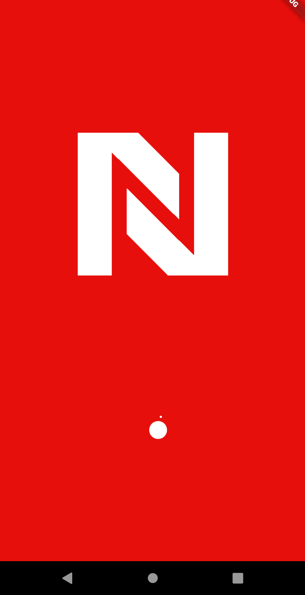
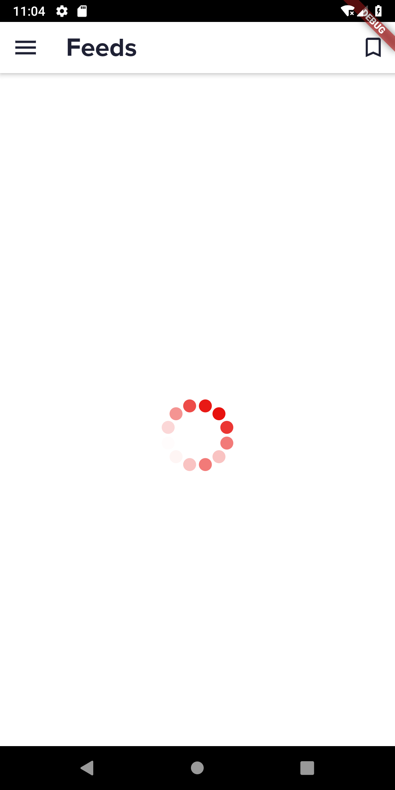
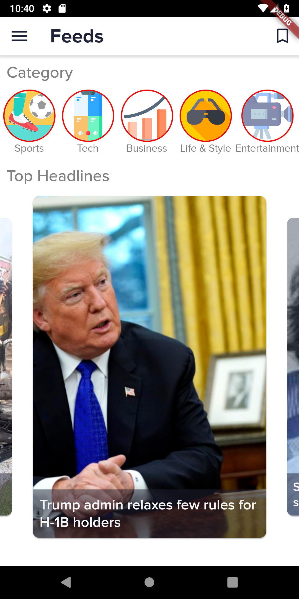
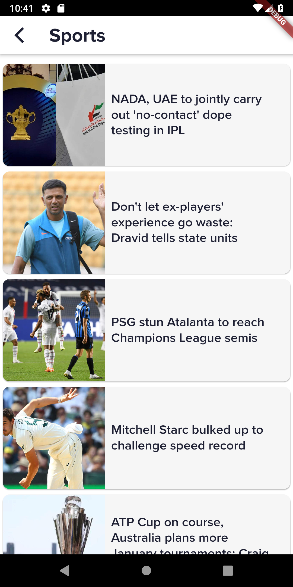
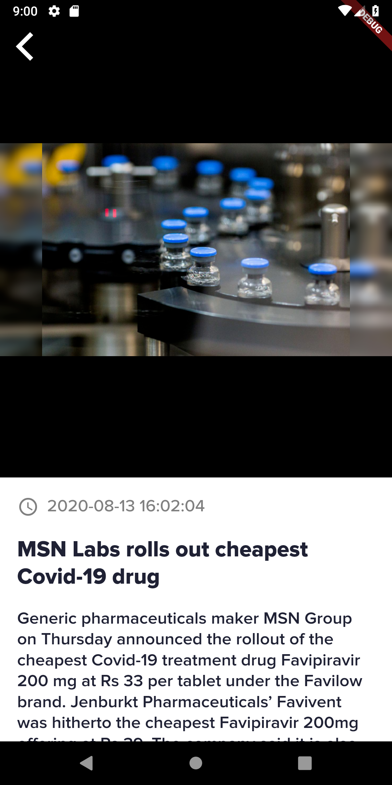
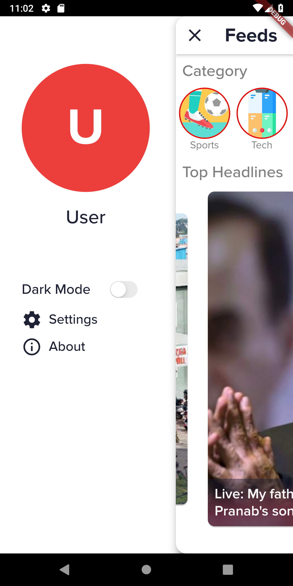
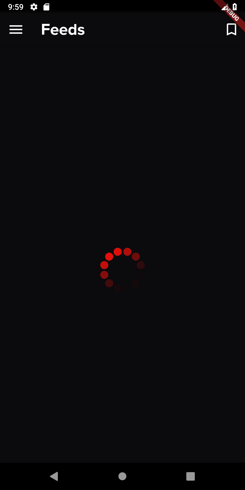
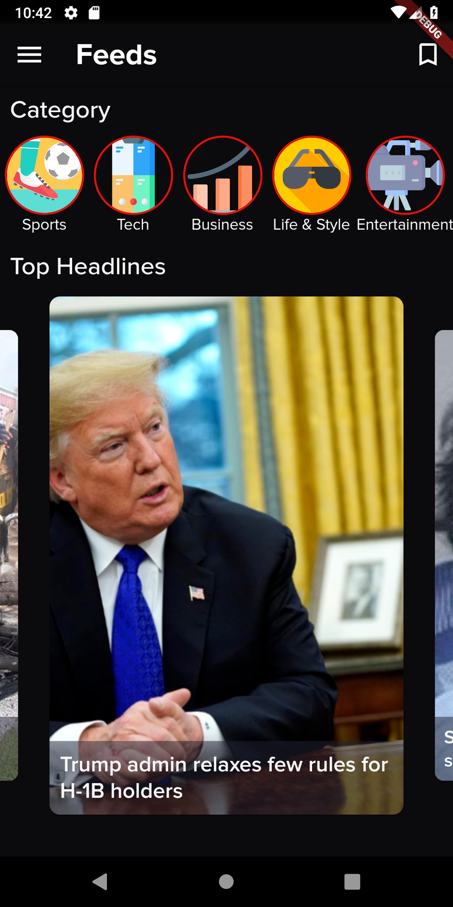
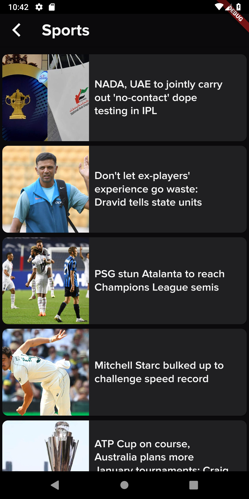
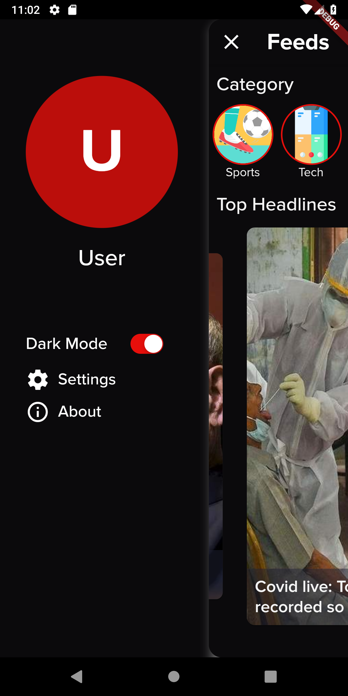

## Nova News 

A Nova News is a news app built with Flutter. In this app, there is a Home page, which will display top stories from Times Of India RSS feeds. News categories ranges from sports to health. You can choose news category displayed on Main page. 

 ## Todos

- [x] List Top Stories
- [x] View news by category
- [x] Profile page
- [x] Go to detail news website.
- [x] Animations
- [x] Beautiful UI with Dual themes ie. Light Theme and Dark Theme
- [x] Fetch news rss feed of Times Of Inida api
- [x] Parse complicated JSON.
- [x] Display full news detail

## ScreenShots
 ### Light Theme
             
           
  ### Dark Theme
             
           

## Getting Started

This project is a starting point for a Flutter application.

A few resources to get you started if this is your first Flutter project:

- [Lab: Write your first Flutter app](https://flutter.dev/docs/get-started/codelab)
- [Cookbook: Useful Flutter samples](https://flutter.dev/docs/cookbook)

For help getting started with Flutter, view our
[online documentation](https://flutter.dev/docs), which offers tutorials,
samples, guidance on mobile development, and a full API reference.
